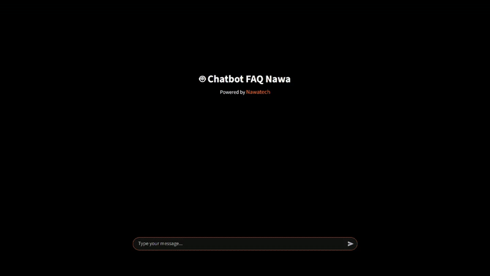

# 🤖 FAQ Chatbot

An intelligent chatbot designed to answer frequently asked questions about Nawatech, making it easy for people to find information quickly in an interactive way.


## 📑 Table of Contents
  <ol>
    <li><a href="#🔎-introduction">Introduction</a></li>
    <li><a href="#🎥-demo">Demo</a></li>
    <li><a href="#✨-features">Features</a></li>
    <li><a href="#📂-dataset">Dataset</a></li>
    <li><a href="#🧠-model-approach">Model / Approach</a></li>
    <li><a href="#⚙️-installation-setup">Installation / Setup</a></li>
    <li><a href="#🚀-usage">Usage</a></li>
    <li><a href="#📊-results">Results</a></li>
    <li><a href="#📂-project-structure">Project Structure</a></li>
    <li><a href="#🙏-acknowledgments">Acknowledgments</a></li>
  </ol>


## 🔎 Introduction
Accessing accurate information quickly is essential, especially when users have many questions about a service or product. A key challenge is providing fast and consistent answers to **frequently asked questions (FAQs)**.

This project introduces an **intelligent FAQ chatbot** that delivers context-aware responses through natural conversations, helping users find information quickly and interactively.

By automating FAQ responses, the chatbot improves user experience, reduces manual support efforts, and ensures information is always available on demand.


## 🎥 Demo
  

*(Example: Chatbot running on a Streamlit web app)*


## ✨ Features
- Provides **instant answers** to user queries in real-time.  
- Trained on an **FAQ and domain-specific dataset** for high accuracy.  
- Supports **context-aware conversations** using embeddings.  
- Utilizes **top_k=2** for varied responses, achieving up to **95% accuracy**.  
- Offers an **interactive Streamlit interface** for chatting with the bot.  
- **Containerized with Docker** for lightweight deployment.  


## 📂 Dataset
- Source: [FAQ NawaTech](FAQ_Nawa.xlsx)  
- Format: Excel file with Question and Answer pairs.  


## 🧠 Method
- **Type**: Retrieval-Augmented Generation (RAG) Chatbot.  
- **Components**:  
  - **Embeddings**: ChromaDB with SentenceTransformer (`all-MiniLM-L6-v2`).  
  - **LLM**: LLaMA via LangChain + Groq for fast inference.  
  - **Retriever**: Semantic similarity search (`top_k=2`).  
- **Techniques**:  
  - Exception handling, input validation, and security measures.  
  - Docker-based deployment for scalability and production readiness.  
- **Performance**:  
  - Achieved **95% response accuracy** on FAQ dataset.  
  - Provides context-aware answers through RAG pipeline.  


## ⚙️ Installation / Setup

### Prerequisites

* Python 3.10 or 3.11
* [Groq API Key](https://console.groq.com/home) (for running LLaMA)
* Docker (optional, for containerized deployment)

### Steps

```bash
git clone https://github.com/username/nawa-chatbot.git
cd nawa-chatbot/app
pip install -r requirements.txt
```

If you use **Docker**:

```bash
docker build -t chatbot .
docker run -p 8501:8501 --env-file .env chatbot
```


## 🚀 Usage

### Run the chatbot locally

```bash
streamlit run main.py
```

### Example Interaction

```
User: Kamu siapa?  
Bot: Kami adalah kumpulan talenta yang bersemangat yang ...
```


## 📊 Results

* Achieved **95% accuracy** in understanding user intents.
* Generates **context-aware responses** using **RAG (Retrieval-Augmented Generation)**.
* Handles multiple user queries while maintaining conversational context.


## 📂 Project Structure

```
├── app/                        # Source code for the chatbot
│   ├── .streamlit/config.py     # Streamlit configuration
│   ├── resources/FAQ_Nawa.xlsx  # Dataset
│   ├── Dockerfile               # Docker setup
│   ├── chains.py                # Logic for RAG/response chains
│   ├── faq_loader.py            # Loads and processes FAQ dataset
│   ├── main.py                  # Entry point for the Streamlit app
│   ├── requirements.txt         # App-specific dependencies
│   ├── styles.css               # Custom CSS for the app
│   └── utils.py                 # Helper functions
├── FAQ_Nawa.xlsx                # Dataset for FAQs
├── chatbot_optimization.ipynb   # Notebook showing improvements (accuracy, exception handling, security)
├── requirements.txt             # Global dependencies
└── README.md                    # Project documentation

```

## 🙏 Acknowledgments

* Dataset and project resources provided by [Nawatech](https://www.nawatech.co/).
* Thanks to **Groq** for providing a **fast and free API**, used with **LangChain** for context-aware responses.


